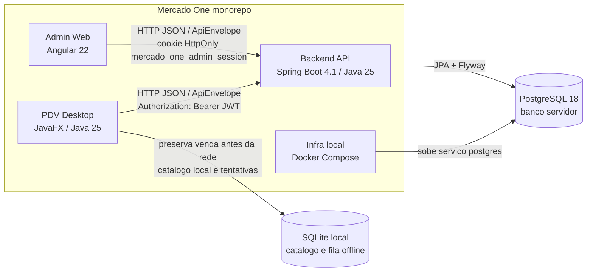
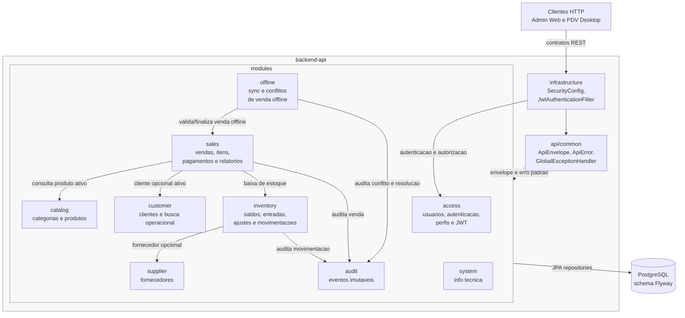
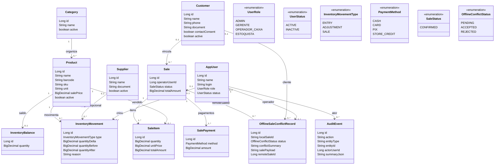
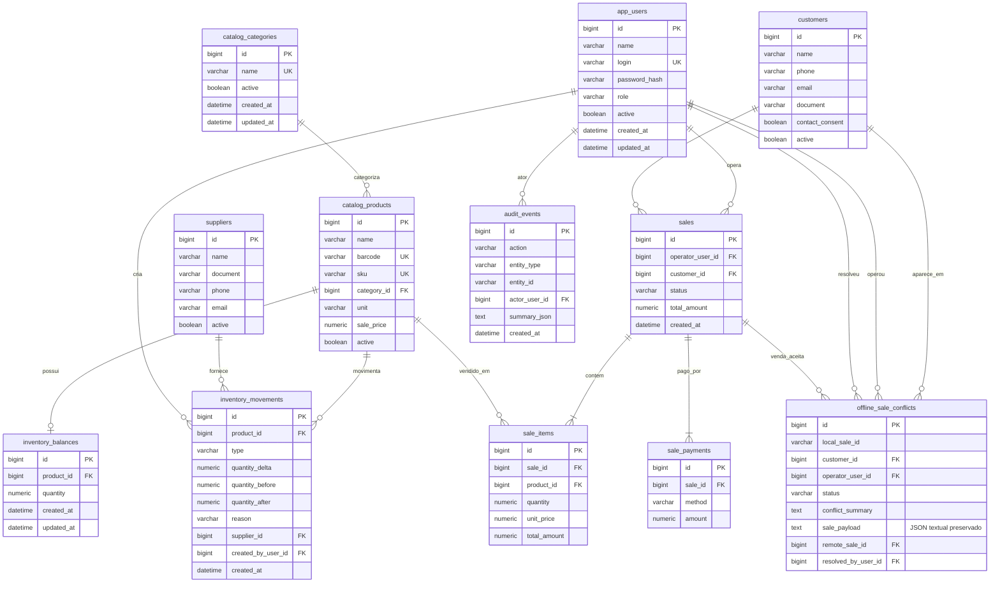
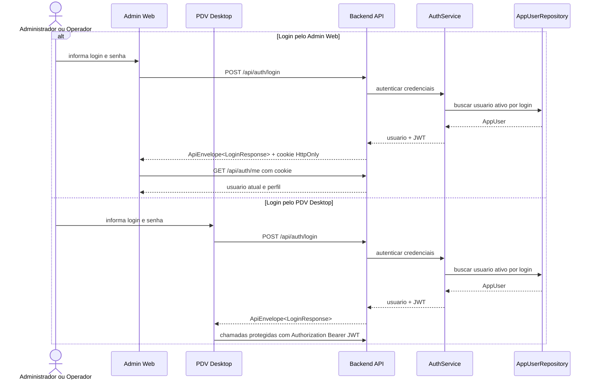
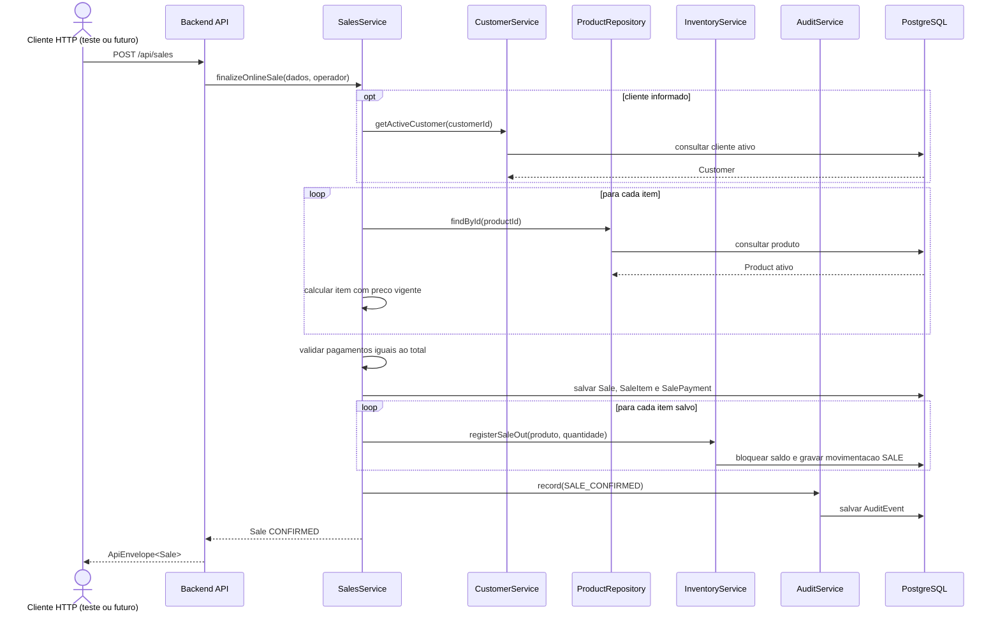
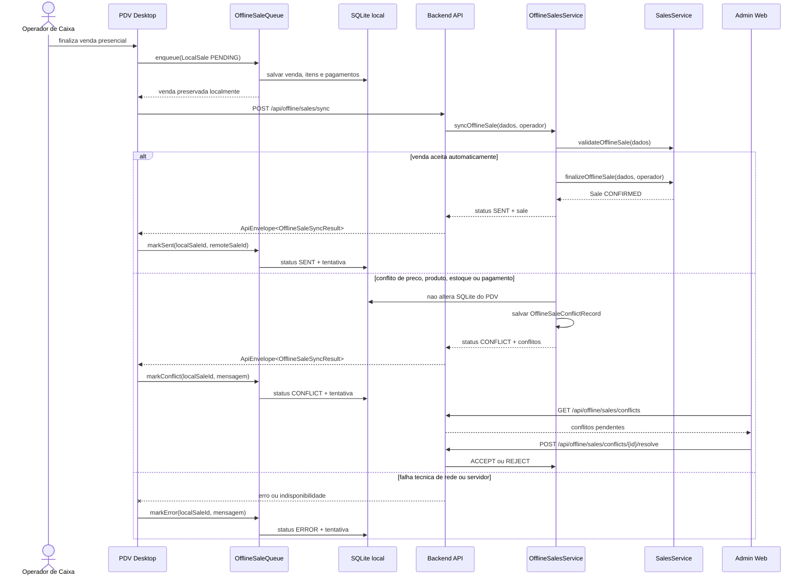
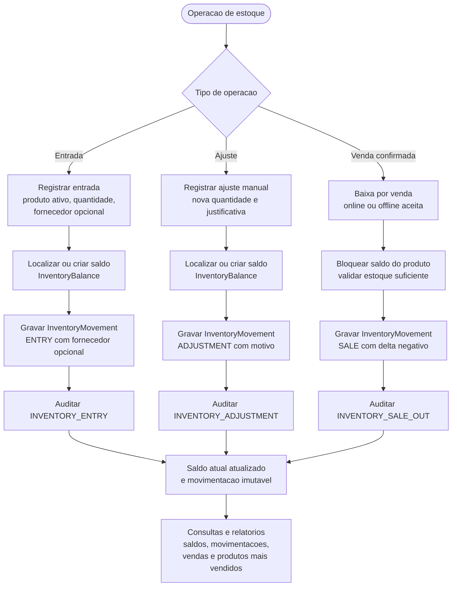

# Diagramas UML e Mermaid

Este documento reune diagramas versionaveis em Mermaid para explicar a arquitetura, o modelo de dominio e os fluxos criticos do Mercado One. Os diagramas refletem o estado atual do projeto: monorepo com administrativo web, API central, PDV desktop offline-first, PostgreSQL servidor e SQLite local do PDV.

Use estes diagramas como ponto de entrada antes de abrir o codigo. Para detalhes normativos, consulte tambem `README.md`, `CONTEXT.md`, `docs/arquitetura.md`, `docs/api-contratos.md`, `docs/dados-e-migracoes.md` e `docs/offline-pdv-sync.md`.

A fonte normativa e o Mermaid deste arquivo. JSON/HTML em `docs/diagramas/` sao copias visuais de verificacao e podem estar defasados (varios ainda mostram `POST /api/sales` saindo do PDV). `UML_drawio(1).xml` e sketch conceitual de estoque, nao diagrama de arquitetura atual.

## Indice

1. [Componentes do sistema](#componentes-do-sistema)
2. [Arquitetura do backend](#arquitetura-do-backend)
3. [Dominio principal](#dominio-principal)
4. [Banco servidor](#banco-servidor)
5. [Login e sessao](#login-e-sessao)
6. [Venda confirmada no servidor](#venda-confirmada-no-servidor-post-apisales)
7. [Venda no PDV](#venda-no-pdv-fila-local-e-sincronizacao)
8. [Estado da venda offline local](#estado-da-venda-offline-local)
9. [Fluxo de estoque](#fluxo-de-estoque)

## Componentes do sistema

Use este diagrama para entender os executaveis do monorepo, os bancos usados e os contratos entre Admin Web, Backend API e PDV Desktop.

## Arquitetura do backend

Use este diagrama para localizar responsabilidades no backend. As fatias de negocio vivem em `modules/`; contratos HTTP transversais ficam em `api/common`; configuracoes compartilhadas ficam em `infrastructure`.

## Dominio principal

Use este diagrama para entender as entidades persistidas e enums centrais. Ele omite controllers, DTOs e campos fiscais detalhados para manter foco no dominio.

## Banco servidor

Use este ERD para revisar as tabelas servidoras criadas pelas migrations Flyway de `V2` a `V7`. O SQLite local do PDV aparece em diagramas separados porque nao e fonte primaria de cadastro.

## Login e sessao

Use este diagrama para comparar o login do Admin Web e do PDV. O mesmo endpoint autentica usuario ativo, mas o Admin Web usa cookie HttpOnly e o PDV usa token Bearer.

## Venda confirmada no servidor (`POST /api/sales`)

Use este diagrama para o contrato HTTP de venda com preco vigente do servidor. A UI do PDV **nao** dispara este endpoint; o caixa atual usa o fluxo da secao seguinte. Testes de `SalesController` e `OnlineSaleClient.finalizeSale` exercitam este contrato.

## Venda no PDV (fila local e sincronizacao)

Use este diagrama para o fluxo real da UI JavaFX: a venda e gravada localmente antes de qualquer tentativa de rede, inclusive quando a API esta no ar. Conflitos ou falhas nao apagam o registro original. `ACCEPT`/`REJECT` no admin nao alteram o SQLite do PDV.

## Estado da venda offline local

Use este diagrama para revisar o ciclo de vida persistido no SQLite do PDV. `PENDING`, `ERROR` e `CONFLICT` mantem a venda local preservada.

```mermaid
stateDiagram-v2
    [*] --> PENDING: venda gravada localmente

    PENDING --> SENT: API aceita sync
    PENDING --> CONFLICT: API registra conflito
    PENDING --> ERROR: falha tecnica

    ERROR --> SENT: reenvio no login aceito
    ERROR --> CONFLICT: reenvio no login gera conflito

    CONFLICT --> CONFLICT: venda original preservada\nadmin resolve no servidor;\nSQLite permanece CONFLICT
    SENT --> [*]: venda sincronizada

    note right of PENDING
        PDV sempre grava antes
        de tentar comunicar com a API.
    end note

    note right of CONFLICT
        Conflito nao apaga a venda.
        Admin Web aceita ou rejeita
        a pendencia no servidor.
    end note
```

## Fluxo de estoque

Use este diagrama para entender as tres origens de movimentacao de estoque no MVP: entrada, ajuste manual e baixa por venda.

## Fora do escopo destes diagramas

- Casos de uso detalhados: o backlog MVP ja comunica esse escopo com mais precisao.
- Deployment cloud ou producao: a infraestrutura documentada hoje e local.
- Diagramas de telas Angular ou JavaFX: ha wireframes de planejamento em `docs/diagramas-interface-web/`; as telas reais mudam mais rapido que esses HTML.
- Modulos fora do MVP, como NFC-e, NF-e, TEF, financeiro completo, multi-loja, e-commerce ou aplicativo mobile.
