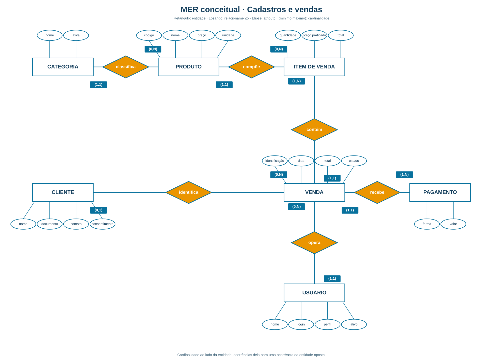
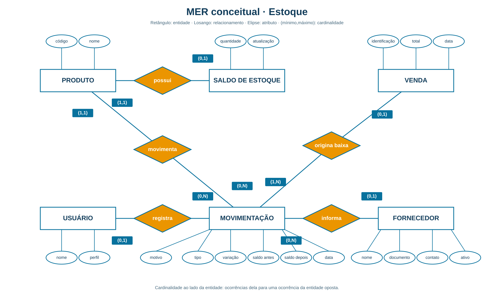
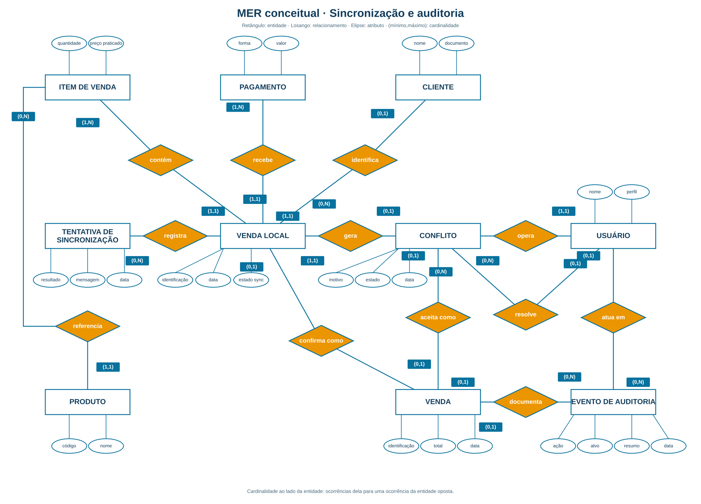

# Modelo entidade-relacionamento conceitual

Este MER representa os **conceitos do negócio** implementados no Mercado One. A notação segue o exemplo fornecido: retângulos são entidades, losangos são relacionamentos e elipses são atributos. Cada ligação mostra a cardinalidade mínima e máxima junto à entidade correspondente. Por exemplo, no relacionamento `CATEGORIA — classifica — PRODUTO`, `(1,1)` junto a Categoria significa que cada Produto pertence a exatamente uma Categoria; `(0,N)` junto a Produto significa que uma Categoria pode classificar nenhum ou muitos Produtos.

Cada visão é um grafo conectado: uma entidade aparece apenas uma vez nela. Produto, Usuário, Cliente e Venda reaparecem entre visões porque participam de relacionamentos que atravessam as áreas do sistema. Os atributos técnicos, tipos e restrições de armazenamento estão no [dicionário de dados](dicionario-de-dados.md). As fontes editáveis dos diagramas usam a [notação Chen do PlantUML](https://plantuml.com/er-diagram).

## Cadastros e vendas

[Fonte PlantUML desta visão](assets/mer-conceitual-vendas.puml).

- Cada Venda é operada por um Usuário e contém um ou mais Itens de Venda e um ou mais Pagamentos.
- Cada Item de Venda pertence a uma Venda e refere-se a um Produto. Quantidade, preço praticado e total são atributos do Item, pois podem variar entre vendas do mesmo Produto.
- O Cliente é opcional na Venda. Uma Categoria pode existir sem Produto, e um Produto pode nunca ter sido vendido.

## Estoque

[Fonte PlantUML desta visão](assets/mer-conceitual-estoque.puml).

- Cada Saldo de Estoque pertence a um Produto; um Produto pode não ter saldo criado ainda.
- Cada Movimentação altera um Produto e guarda a variação e os saldos anterior e posterior. Fornecedor e Usuário autor podem estar ausentes conforme a origem da movimentação.
- A confirmação de uma Venda origina uma ou mais Movimentações de saída, uma por Item de Venda. Essa relação entre Vendas e Estoque é operacional: a movimentação não guarda uma referência estruturada à Venda.
- A entrada atual registra um Produto por operação; não há entidade de documento de entrada com múltiplos itens implementada.

## Sincronização e auditoria

[Fonte PlantUML desta visão](assets/mer-conceitual-offline.puml).

- A Venda Local preserva os Itens de Venda e Pagamentos registrados no PDV antes de qualquer tentativa de rede. Ela pode acumular tentativas de sincronização e gerar, no fluxo atual, no máximo um Conflito.
- Cada Item de Venda local referencia um Produto do catálogo central; o PDV usa uma cópia local desse catálogo quando necessário.
- Um Conflito pode ser aceito como Venda confirmada ou rejeitado. O vínculo com a Venda existe somente no caso aceito; a resolução não muda o estado local `CONFLICT` no PDV.
- Uma Venda Local também pode ser confirmada automaticamente, sem gerar Conflito. Nesse caso, ela se relaciona à Venda registrada no servidor.
- Um Evento de Auditoria pode ter Usuário autor identificado e documentar uma Venda. O alvo é descrito textualmente, sem chave estrangeira; eventos também podem se referir a outros tipos de alvo, como conflito, venda local, movimentação ou usuário.
- O catálogo local do PDV é uma cópia de Produto, portanto não introduz uma nova entidade de negócio.

## Limites da representação

As cardinalidades `1,N` de Item de Venda e Pagamento expressam a regra de finalização da aplicação; o armazenamento, isoladamente, não impõe esse mínimo. Os vínculos `Venda Local — Conflito` e `Venda Local — Venda` cruzam o PDV e o servidor e são associações conceituais, sem integridade referencial entre bancos. A cardinalidade máxima de uma Venda confirmada por Venda Local expressa o fluxo esperado, sem restrição de unicidade entre os bancos. Não há conceito de Mercado multiloja persistido no estado atual.

Fontes: [glossário de domínio](../CONTEXT.md), [migrações do servidor](../backend-api/src/main/resources/db/migration/), [fila local do PDV](../pdv-desktop/src/main/java/com/mercadoone/pdv/offline/OfflineSaleQueue.java), [catálogo local](../pdv-desktop/src/main/java/com/mercadoone/pdv/offline/OfflineCatalogStore.java) e [regras de sincronização](offline-pdv-sync.md).
